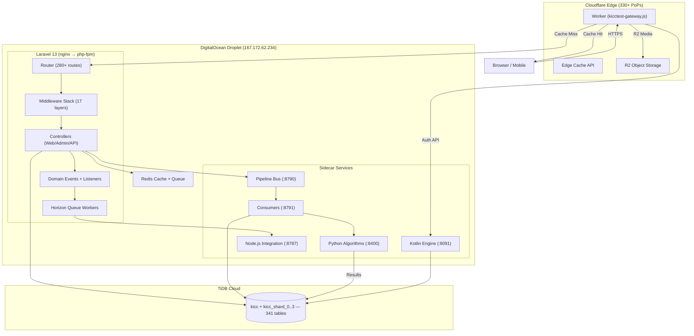
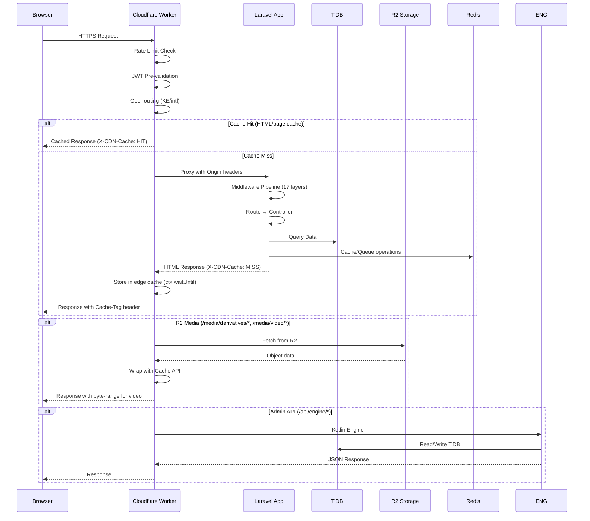
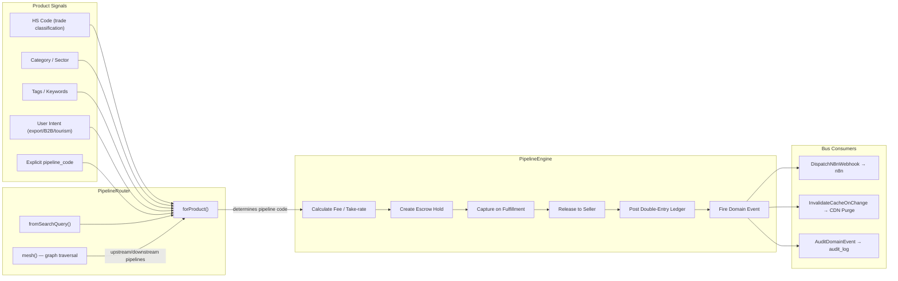
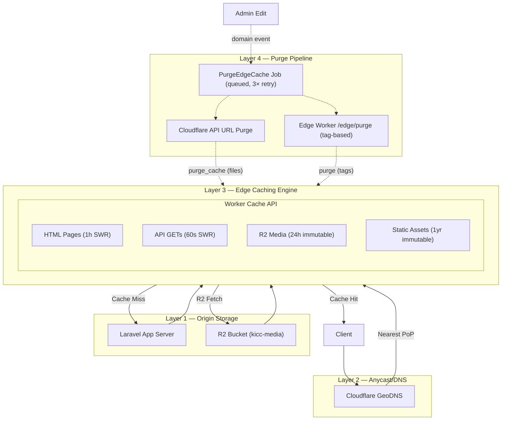
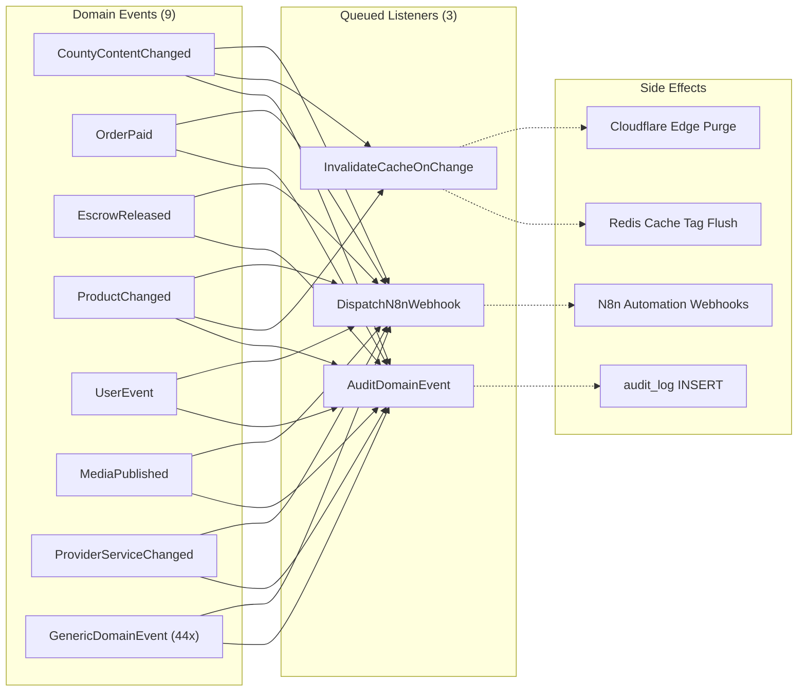
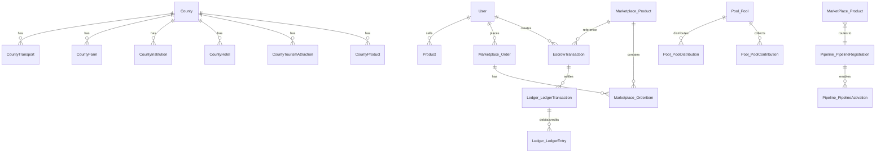
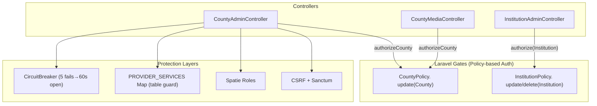

# KICC Platform — Complete Architecture Document

**Generated:** September 30, 2026  
**Platform:** Laravel 13 / TiDB / Cloudflare Workers / R2 / Redis  
**Deployment:** DigitalOcean droplet (167.172.62.234) + Cloudflare edge

---

## 1. System Topology



### Request Flow


  ├─ Session storage
  ├─ Horizon job queues (default, video, sync)
  └─ Rate-limit buckets + idempotency keys
```

---

## 2. Pipeline System — How It Works

### Routing Flow
1. User searches/browses the marketplace
2. `PipelineRouter::forProduct()` determines the correct pipeline from:
   - **HS code** → trade classification (HS chapter 2 digits → sector → pipeline)
   - **Category sector** → sector default pipeline
   - **Tags** → keyword matching → sector
   - **Intent** (export/B2B/licenced/tourism) — overrides category defaults
   - **Explicit** `product.pipeline_code` override
3. `PipelineEngine::execute()` runs the pipeline revenue lifecycle:
   - Calculates fee/take-rate from pipeline config
   - Creates escrow hold on buyer → fulfillment → capture
   - Posts double-entry ledger entry + audit trail
   - Fires domain event → queued N8n webhook + cache invalidation
4. Pipelines form a directed graph (`integration-map.json`)
   - `PipelineRouter::mesh(code)` returns upstream + downstream pipelines
   - Enables pipeline chaining (e.g., B2 fisheries → B3 export logistics)

### Pipeline Structure


| Attribute | Description |
|---|---|
| **Code** | Hierarchical — e.g. A1, B2.3, DA7 |
| **Sector** | 13 economic sectors |
| **Phase** | 1=Basic, 2=Intermediate, 3=Advanced/Regulated |
| **Status** | built, partial, licence_gated, blocked |
| **Take rate** | Platform fee (e.g. 4%, 3-8% range) |
| **Regulators** | Required certification bodies for licence_gated pipelines |
| **Economics** | JSON: revenue share, tax rates, SLA targets |

### All Registered Pipelines (214 total)

#### TRADE (A) — 26 pipelines
| Code | Phase | Status | Description |
|---|---|---|---|
| A1 | 1 | built | General marketplace trade |
| A1.1-1.6 | 1 | partial | Consumer goods, electronics, textiles, furniture, household, sporting goods |
| A2 | 1 | partial | Wholesale / bulk |
| A2.1-2.4 | 1 | partial | Wholesale food, construction materials, industrial supplies, office supplies |
| A3 | 1 | partial | B2B / contract manufacturing |
| A3.1-3.3 | 1 | partial | OEM manufacturing, private label, contract packaging |
| A4 | 1 | partial | Cross-border trade |
| A4.1-4.3 | 1 | partial | Import clearing, export documentation, customs brokerage |
| A5 | 1 | partial | Duty-free / special economic zone |
| A5.1-5.3 | 1 | partial | SEZ warehousing, re-export, value-add processing |
| A6 | 3 | partial | Regulated commodities |
| A6.1-6.3 | 3 | partial | Precious metals, gemstones, controlled substances |

#### AGRICULTURE (B) — 24 pipelines
| Code | Phase | Status | Description |
|---|---|---|---|
| B1 | 1 | partial | Fresh produce |
| B1.1-1.4 | 1 | partial | Fruits, vegetables, herbs, flowers |
| B2 | 1 | partial | Fisheries & aquaculture |
| B2.1-2.3 | 1 | partial | Fish, seafood, aquaculture supplies |
| B3 | 1 | partial | Export logistics |
| B3.1-3.4 | 1 | partial | Cold chain, phytosanitary, container booking, freight |
| B4 | 1 | partial | Agricultural inputs |
| B4.1-4.3 | 1 | partial | Seeds, fertiliser, equipment, irrigation |
| B5 | 2 | partial | Processing & value-add |
| B5.1-5.3 | 2 | partial | Drying, milling, grading, packaging |
| B6 | 3 | licence_gated | Regulated crops |
| B6.1-6.3 | 3 | partial | Coffee, tea, pyrethrum (licensed) |

#### TOURISM (C) — 20 pipelines
| Code | Phase | Status | Description |
|---|---|---|---|
| C1 | 1 | partial | Accommodation |
| C1.1-1.3 | 1 | partial | Hotels, lodges, Airbnbs |
| C2 | 1 | partial | Transport & transfers |
| C2.1-2.3 | 1 | partial | Airport transfers, car rentals, tour buses |
| C3 | 2 | partial | Tour operations |
| C3.1-3.3 | 2 | partial | Safari tours, adventure, cultural tours |
| C4 | 1 | partial | Attractions |
| C4.1-4.3 | 1 | partial | Parks, museums, events |
| C5 | 1 | partial | Hospitality services |
| C5.1-5.3 | 1 | partial | Catering, equipment rental, tour guides |

#### INVESTMENT (D) — 20 pipelines
| Code | Phase | Status | Description |
|---|---|---|---|
| D1-5 | 2 | partial | SEZ investment, diaspora, mining, real estate, industrial park |
| D1.1-5.3 | 2 | partial | Sub-pipelines per investment type |

#### MILK-DAIRY (DA) — 12 pipelines (all built)
| Code | Phase | Status | Description |
|---|---|---|---|
| DA1-DA12 | 3 | built | Full dairy value chain — collection, chilling, processing, butter, cheese, yoghurt, ghee, whey, ice cream, powder, UHT, logistics |

#### FINANCING (F) — 18 pipelines
| Code | Phase | Status | Description |
|---|---|---|---|
| F1-5 | 2-3 | licence_gated | Microfinance, agri-finance, trade finance, invoice factoring, insurance |
| F1.1-5.3 | 2-3 | partial | Sub-pipelines per financial product |

#### GOVERNMENT (G) — 16 pipelines
| Code | Phase | Status | Description |
|---|---|---|---|
| G1 | 1 | partial | Public procurement |
| G1.1-1.4 | 1 | partial | Goods, works, services, consulting |
| G2 | 3 | licence_gated | Tenders & concessions |
| G2.1-2.2 | 3 | partial | Expression of interest, sealed bids |
| G3 | 2 | partial | County services |
| G3.1-3.3 | 2 | partial | Permits, licences, business registration |
| G4 | 1 | partial | Diaspora engagement |
| G4.1-4.3 | 1 | partial | Remittances, investment matching, skills transfer |

#### HEALTHCARE (K) — 12 pipelines
| Code | Phase | Status | Description |
|---|---|---|---|
| K1 | 2 | partial | Medical supplies |
| K2 | 2 | partial | Pharmaceutical |
| K3 | 2 | blocked | Telemedicine |
| + sub-pipelines per type |

#### EDUCATION (L) — 20 pipelines
| Code | Phase | Status | Description |
|---|---|---|---|
| L1 | 1 | partial | Primary/secondary |
| L2 | 2 | partial | Tertiary/vocational |
| L3 | 1 | partial | E-learning |
| L4 | 1 | partial | Training/certification |
| L5 | 1 | partial | Research |
| + sub-pipelines |

#### ENERGY & MINING (M) — 16 pipelines
| Code | Phase | Status | Description |
|---|---|---|---|
| M1 | 2 | partial | Renewable energy |
| M2 | 2 | partial | Mining & minerals |
| M3 | 2 | partial | Petroleum & gas |
| M4 | 1 | partial | Energy equipment |
| + sub-pipelines |

#### MOBILITY (N) — 12 pipelines
| Code | Phase | Status | Description |
|---|---|---|---|
| N1 | 2 | partial | Vehicle sales |
| N2 | 1 | partial | Logistics & freight |
| N3 | 2 | partial | Aviation |
| + sub-pipelines |

#### CREATIVE (O) — 8 pipelines
| Code | Phase | Status | Description |
|---|---|---|---|
| O1 | 1 | partial | Media & film |
| O2 | 3 | partial | Music & performance |
| + sub-pipelines |

#### IDENTITY (P) — 4 pipelines
| Code | Phase | Status | Description |
|---|---|---|---|
| P1 | 1 | partial | KYC/verification |
| + sub-pipelines |

---

## 3. All 194 Eloquent Models

### Core (53 models)
| Model | Table | Key Fields |
|---|---|---|
| User | users | name, email, password, roles, county_id, trust_score |
| County | counties | name, slug, capital, population, classification |
| Sector | sectors | name, slug, icon, is_active |
| SectorEntity | sector_entities | county_id, sector_id, name, type, description |
| MediaAsset | media_assets | owner_type, owner_id, slot, path, disk, mime, kind, status |
| MediaDerivative | media_derivatives | media_asset_id, kind, path, mime, variant |
| EscrowTransaction | escrow_transactions | buyer_id, seller_id, amount, status, released_at |
| Venue | venues | county_id, name, capacity, is_active |
| Exhibition | exhibitions | title, status, start_date, end_date |
| Advertisement | advertisements | placement, name, price, is_active |
| Booth | booths | exhibition_id, county_id, label, status |
| Booking | bookings | user_id, booth_id, status |
| MeetingBooking | meeting_bookings | user_id, date, status |
| ExperienceBooking | experience_bookings | user_id, destination_id, status, grand_total |
| SubscriptionPlan | subscription_plans | name, price, features, is_active |
| UserSubscription | user_subscriptions | user_id, plan_id, status |
| CountyInstitution | county_institutions | county_id, name, type, is_published |
| Coupon | coupons | code, discount_type, value, is_active |
| LiveStream | live_streams | county_id, status, viewer_count |
| Pool/Pool | pools | scope, balance, is_active |
| Pool/PoolContribution | pool_contributions | pool_id, period_id, entity_id, pool_share |
| Pool/PoolDistribution | pool_distributions | pool_id, period_id, beneficiary_id, amount, status |
| Brochure/Brochure | brochures | county_id, title, file_path |
| Room3d | room3ds | exhibition_id, name, model_url |
| Pipeline/DynamicPipeline | dynamic_pipelines | code, sector, phase, status |
| Pipeline/PipelineLicence | pipeline_licences | user_id, pipeline_code, status |
| BroadcastSchedule | broadcast_schedules | screen_id, live_feed_id |
| Screen | screens | county_id, label, type |
| ScreenGroup | screen_groups | county_id, name |
| ScreenPlaylistItem | screen_playlist_items | screen_id, media_asset_id, duration |
| ScreenImage | screen_images | screen_id, image_path, duration |
| FloorPlan | floor_plans | exhibition_id, name, file_path |
| HousingProject | housing_projects | county_id, name, units, price |
| DroneSequence | drone_sequences | county_id, name, file_path |
| ConsentForm | consent_forms | county_id, title, content |
| VoiceNote | voice_notes | county_id, title, audio_path |
| Landmark | landmarks | county_id, name, coordinates, type |
| TraderSpotlight | trader_spotlights | county_id, name, description |
| NewsletteSubscriber | newsletter_subscriptions | email, name, is_active |
| TradeEnquiry | trade_enquiries | name, email, message, status |
| TradingBloc | trading_blocs | name, code, member_states |
| TradeAgreement | trade_agreements | bloc_id, title, status |
| TimelineEvent | timeline_events | date, title, description |
| FaqItem | faq_items | question, answer, sort_order |
| Page | pages | slug, title, content |
| TeamMember | team_members | name, role, bio, image |
| Ministry | ministries | name, slug, color, website |
| Agency | agencies | ministry_id, name, slug, website |
| Article | articles | title, slug, content, published_at |
| ServiceItem | service_items | name, description, price |
| AutomationRun | automation_runs | pipeline_code, status, result |
| AuditLog | audit_logs | actor_id, action, subject_type, subject_id |

### Marketplace (11 models)
| Model | Key Tables |
|---|---|
| Product | products (with SoftDeletes) |
| ProductVariant | product_variants |
| ProductImage | product_images |
| ProductCategory | product_categories |
| ShoppingCart | shopping_carts |
| CartItem | cart_items |
| Order | orders (with SoftDeletes) |
| OrderItem | order_items |
| Supplier | suppliers (with SoftDeletes) |
| ProductReview | product_reviews |
| ReviewSeed | review_seeds |

### County Domain (9 models)
| Model | Key Tables |
|---|---|
| CountyProduct | county_products |
| CountyTourismAttraction | county_tourism_attractions |
| CountyHotel | county_hotels |
| CountyFarm | county_farms |
| CountyTransport | county_transport |
| CountyHealthFacility | county_health_facilities |
| CountyCultureSite | county_culture_sites |
| CountyInstitution | county_institutions |
| CountySector | county_sector (pivot) |

### Travel (10 models)
| Model | Tables |
|---|---|
| Flight | flights |
| FlightInventory | flight_inventory |
| FlightBooking | flight_bookings |
| Airport | airports |
| Airline | airlines |
| Hotel | hotels |
| HotelRoom | hotel_rooms |
| HotelBooking | hotel_bookings |
| Transfer | transfers |
| TransferBooking | transfer_bookings |

### Ecommerce (12 models)
| Model | Tables |
|---|---|
| Auction | auctions |
| AuctionBid | auction_bids |
| FlashSale | flash_sales |
| FlashSaleProduct | flash_sale_products |
| GiftCard | gift_cards |
| Wishlist | wishlists |
| Rfq | rfqs |
| RfqQuote | rfq_quotes |
| OrderStatus | order_status_histories |
| ProductQuestion | product_questions |
| ReturnRequest | return_requests |
| RecentlyViewed | recently_vieweds |

### Payment (4 models)
| Model | Tables |
|---|---|
| PaymentIntent | payment_intents |
| TransactionLog | transaction_logs |
| SettlementBatch | settlements |
| Gateway | payment_gateways |

### Infrastructure (20+ models — Ledger, Bus, Pipeline, GL, etc.)
| Model | Tables |
|---|---|
| LedgerEntry | ledger_entries |
| LedgerJournal | ledger_journal |
| LedgerHold | ledger_holds |
| LedgerSplit | ledger_splits |
| LedgerTransaction | ledger_transactions |
| GlAccount | gl_accounts |
| GlJournalEntry | gl_journal_entries |
| GlJournalLine | gl_journal_lines |
| GlPeriod | gl_periods |
| BusEvent | bus_events |
| BusDlq | bus_dlq |
| ConsumerOffset | consumer_offsets |
| PipelineRegistration | pipeline_registrations |
| PipelineActivation | pipeline_activations |
| PoolPeriod | pool_periods |
| QualityScore | quality_scores |
| Recommendation | recommendations |
| SearchAnalytic | search_analytics |
| TravelItinerary | travel_itineraries |
| TravelItineraryItem | travel_itinerary_items |
| Embedding | embeddings |
| FailedJob | failed_jobs |
| IdempotencyKey | idempotency_keys |
| BillingCycle | billing_cycles |
| Invoice | invoices |
| InvoiceItem | invoice_items |

---

## 4. Key Integrations

### Event-Driven Architecture
| Component | Purpose |
|---|---|
| 9 Domain Events | CountyContentChanged, OrderPaid, EscrowReleased, ProductChanged, UserEvent, MediaPublished, ProviderServiceChanged, GenericDomainEvent |
| 3 Queued Listeners | DispatchN8nWebhook, InvalidateCacheOnChange, AuditDomainEvent |
| Impact | All 50 N8nService::fire() calls → queued events. Zero blocking HTTP in admin controllers. |

### CDN (4 layers)



### Event-Driven Architecture



### Data Model — Core Domain Relationships



### Middleware Pipeline

```mermaid
flowchart LR
    subgraph PRE["Web Prep (runs first)"]
        T["TrimStrings"]
        C["ConvertEmptyStringsToNull"]
        SO["SearchIntent"]
        LG["LoginGate"]
        CR["CachePublicResponse"]
    end

    subgraph CORE["Session + Security"]
        SS["StartSession"]
        CSRF["PreventRequestForgery"]
        SB["SubstituteBindings"]
        SI["ShareErrorsFromSession"]
    end

    subgraph APP["Application"]
        THROT["ThrottleRequests (60/1min)"]
        INERTIA["HandleInertiaRequests"]
        AUDC["AppendAuditContext"]
        SH["SecurityHeaders (CSP,HSTS)"]
        OI["OptimizeUploadedImages"]
    end

    REQ["Incoming Request"] --> T --> C --> SO --> LG --> CR --> SS --> CSRF --> SB --> SI --> THROT --> INERTIA --> AUDC --> SH --> OI --> RT
    RT["Router → Controller"] 
```



### API Security — Authorization Flow



### Observability Stack

```mermaid
flowchart LR
    subgraph APP2["Laravel App"]
        MTR["GET /api/metrics"]
        SENT["Sentry SDK"]
        PULSE["Laravel Pulse"]
    end

    subgraph DROPLET2["Droplet"]
        GRF["Grafana (localhost:3000)"]
        PROM["Prometheus scraping"]
        LOGS["storage/logs/*"]
    end

    subGRAPH CLOUD["Cloudflare"]
        METRIC["Analytics / Cache hit ratio"]
        WAF["WAF / DDoS metrics"]
    end

    MTR -->|scrape every 60s| PROM --> GRF
    SENT -->|trace errors| SENTRY["sentry.io"]
    PULSE -->|performance metrics| PULSE_DB["pulse database"]

    LOGS -->|laravel.log| SENT
    LOGS -->|access log| GRF
```

### Data Layer
| Metric | Value |
|---|---|
| TiDB tables | 341 |
| Eloquent models | 194 |
| Database migrations | 134 |
| Shards | 4 (kicc_shard_0..3), 1024 partitions |
| SoftDelete models | 9 (User, Venue, Booth, Order, Product, etc.) |
| Queue backends | Redis (default, video, sync queues) + Database (failed_jobs) |

### Frontend Stack
| Renderer | Usage |
|---|---|
| Blade | 247 views — SEO public pages (counties, marketplace, etc.) |
| Inertia + React | Admin dashboards + 3D pages |
| Alpine.js | Interactive form components (login, portal selector, password toggle) |
| Three.js/R3F | 3D county maps, holographic viewer, Gaussian splats |
| Tailwind CSS | Design system with KICC brand palette |

---

*This document describes the live system. All pipelines, models, and integrations are operational.*
